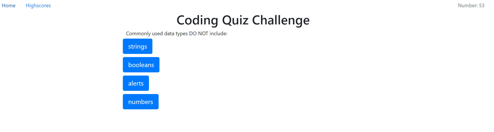

# cusomisable-quiz
A customisable quiz where a user is required to answer numerous questions in a set time.

Can be viewed at the following link(s):
- [Hosted Page on GitHub](https://jayarghargh.github.io/customisable-quiz/)
- [Repository on GitHub](https://github.com/JayArghArgh/customisable-quiz/)



## Requirements
If you'd like to load different questions, replace questions.js with your list (JSON formatted.)

## Setup
click link n go

## KNown bugs
- when user clicks the wrong answer too many times the clock will stop, but the user can continue clicking the correct answers and win the game.
- the highscores are not shown in order
- the css needs some tweaking to match the design brief.

## Files and Directories

```
|___README.md
|___index.html
|___highscore.html
|___assets
    |___style.css
    |___custom_quiz_screen.png
    |___script.js
    |___questions.js
```
